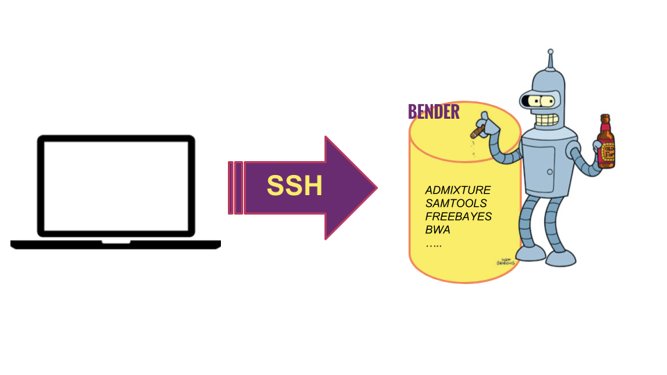
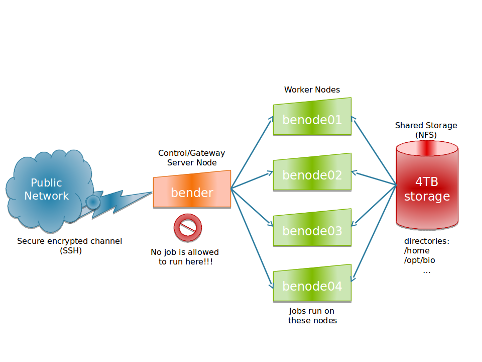

#Summary

- [Projects](#section-id-9)
    - [Familiarize with file formats](#section-id-18)
    - [Ask U.G.O.](#section-id-25)
- [Bender](#section-id-30)
  - [Get there](#section-id-32)
   - [Workspace](#section-id-99)
    - [/home/enza](#section-id-103)
    - [](#section-id-128)
    - [](#section-id-156)
  - [Working on Bender](#section-id-177)
    - [1. Interactive mode](#section-id-179)
    - [2. Submitting jobs to a job scheduler](#section-id-197)
      - [a) Preparing the PBS script](#section-id-211)
      - [b) Submitting the job to PBS](#section-id-249)
      - [c) Checking the job status](#section-id-256)
  - [How to](#section-id-278)


<div id='section-id-9'/>

# Projects

This is how the projects are going to work:


Projects will start from `.fastq` files and will end with a beautiful image ready to be published!

You will work in group, however tasks of the two days will be performed individually, while tasks of the last day will be performed as group. In practice each person in the group will process part of the `fastq` files and eventually all the efforts will be merged in the last day from variant calling onward.

<div id='section-id-18'/>

### Familiarize with file formats

When working on projects, you will soon find out that most of the time will be spent to understand the file formats. Don't rush, take time to understand in/output file structure. Read the examples; in general software comes with example files, try to run the example first.  


<div id='section-id-25'/>

### Ask U.G.O.

While doing the projects, if you have problems ask first yourself, than people in the group, than others!


<div id='section-id-30'/>

# Bender 

<div id='section-id-32'/>

## Get there

We will be hosted for this course on a machine named Bender.  This machine is on the top floor in this building.

To use remote machine the first step is to get connected to them and one protocol for connection is called [*Secure Shell*](https://en.wikipedia.org/wiki/Secure_Shell) or *SSH*. 



Before using the remote machine you should have talked to the machine administrator that will create an account for you with a username and a password. Once you obtain an account,  you can use SSH from your terminal. The basic instruction for connection is the command ```ssh``` followed by the username and the [IP address](https://en.wikipedia.org/wiki/IP_address) of the machine. Some times to  simplify we use a literal synonim of the IP address: 

```
$ ssh username@111.111.1111.11

$ ssh usrname@machinename

```

Once connected, if it is the first time you will be asked to confirm that you really want to connect to the machine, otherwise you will be just asked to type a password. 

*Beware: you won't se any letter on your screen while you type the password*


We have greated a shared user name for this course that is ```corso```, while the domani name for the machine is ```bender.igb.cnr.it```. Therefore to  **connect** to Bender we will type: 

```
auser@itslaptop:$ ssh -X corso@bender.igb.cnr.it
      __      __       .__
      /  \    /  \ ____ |  |   ____  ____   _____   ____
      \   \/\/   // __ \|  | _/ ___\/  _ \ /     \_/ __ \
       \        /\  ___/|  |_\  \__(  <_> )  Y Y  \  ___/
        \__/\  /  \___  >____/\___  >____/|__|_|  /\___  >
             \/       \/          \/            \/     \/
        __           __________                   .___
      _/  |_  ____   \______   \ ____   ____    __| _/___________
      \   __\/  _ \   |    |  _// __ \ /    \  / __ |/ __ \_  __ \
       |  | (  <_> )  |    |   \  ___/|   |  \/ /_/ \  ___/|  | \/
       |__|  \____/   |______  /\___  >___|  /\____ |\___  >__|
                             \/     \/     \/      \/    \/

[corso@bender ~]$ 


```
The ``` -X ``` option allow some graphical visualization. 

<div id='section-id-45'/>


## Workspace

Bender is a very organized machine. Let's look a little bit closer to this:  



<div id='section-id-103'/>

### GATEWAY 

This is the access point to Bender form the public network when we ssh to Bender we arrive here as first instance. *We are not allowed to work in this space*, it is instead necessary to go in one of the Worker Nodes (see below).  

<div id='section-id-128'/>

### WORKER NODES 

You can use ```ssh``` to connect to a worker node: 

```
MARIO 
```
but to make life easier we have created a shortcut and to go to node one you only need to type: 

```

```


### $WORK

This is a space assigned to a project. While every user has its own $HOME, many users can share the area of the $WORK related to the same assigned project.  Work is permanent, backed-up and project specific.

● 1 TB quota by default

● Permanent, backed-up

To access this space:
```
cd $WORK
```

If you check where you are using the shell command `pwd` you will see something like this:

```
pwd

/gpfs/work/someprojectname

```
<div id='section-id-177'/>

## Working on PICO

<div id='section-id-179'/>

### 1. Interactive mode
Interactive mode is a command line shell which gives immediate feedback for each statement. The user can interact with the shell.

An example of  interactive use of the shell is:
```
echo thiscourseiscool
thiscourseiscool

```

A little more complicated example of interactive use of the shell is:
```
python myprogram.py inputfile1.txt inputfile2.someextension > myoutput.out

```
Working in interactive mode is OK for small tasks, but if the command line we are executing  takes a lot of memory we might get stuck, and what is worst we will use all the machine power preventing other people from using it.


<div id='section-id-197'/>

### 2. Submitting jobs to a job scheduler

PICO is a shared machine, that means that many users use it at the same time, therefore it is advised and polite to use queues for running commandlines.


PICO has a job scheduling system named PBS. To become familiar with PBS read its interesting story on the [PBS wiki page](https://en.wikipedia.org/wiki/Portable_Batch_System), go through the [official documentation](http://www.pbsworks.com/SupportGT.aspx?d=PBS-Professional,-Documentation), or google for one of the many tutorials available.

In the official documentation we read that PBS consists of a set of commands and system daemons/service that perform these tasks:

- **Queuing jobs**: PBS collects jobs (work or tasks) to be run on one or more computers. Users submit jobs to PBS, where they are queued up until PBS is ready to run them.
- **Scheduling jobs**: PBS selects which jobs to run, and when and where to run them, according to the policy specified by the site administrator.  PBS allows the administrator to prioritize jobs and allocate resources in a wide variety of ways, to maximize efficiency and/or throughput.
- **Monitoring jobs**: PBS tracks system resources, enforces usage policy, and reports usage.  PBS tracks job completion, ensuring that jobs run despite system outages.  

<div id='section-id-211'/>

#### a) Preparing the PBS script

To use PBS we need to  wrap all the relevant instruction in a text file. The PBS file is made of two parts:
- the PBS instructions
- the commandline

It looks like this:

```


#!/bin/bash
#PBS –N myjobname      #name of the job
#PBS -o job.out       #output file
#PBS -e job.err       #error file
#PBS -l select=1:ncpus=20:mpiprocs=20:mem=122GB  #resources
#PBS -l walltime=1:00:00                  #hh:mm:ss
#PBS -q <queue>              #chosen queue
#PBS -A <my_account>   #name of the account
#PBS -W group_list=<group>   #name of effective group for reservation

echo thiscourseiscool
```
Save the file with a reasonable name, e.g. `thisspecificjobpbs.sh`

In this file all the lines starting with `#PBS`  are options for the PBS scheduler, and `-N` in `#PBS -N` indicates the option for giving a name to the job. The other lines are specific to the task we are doing (e.g. printing "thiscourseiscool"). Finally, the file starts with a line `#!/bin/bash` that tells the machine that this is a shell script.

There are many PBS options and they all have default values. Sometimes we need to change the default values, for example we want to change the jobname at every job. Some other times  the default values are OK, and we don't need to include the option specification in the PBS file.

See here(http://www.hpc.cineca.it/sites/default/files/PBSProUserGuide13.0beta.pdf) for a list of PBS options.

A little clarification on the `-l` resources option:

- select = number of nodes requested
- ncpus = number of cpus per node requested
- mpiprocs = number of mpi tasks per node
- mem = RAM memory per node  


<div id='section-id-249'/>

#### b) Submitting the job to PBS

Jobs are submitted using:
```
qsub thisspecificjobpbs.sh
```

<div id='section-id-256'/>

####  c) Checking the job status

Once submitted, it is possible to check the job status using:
```
qstat
```

Most likely you will see many jobs running among which your(s).

```
vcolonna@node013.pico:[CORSOROMA]$ qstat
Job id            Name             User              Time Use S Queue
----------------  ---------------- ----------------  -------- - -----
51133.node001     evolfun          cdarwin                  0 Q parallel        
69083.node001     nicegenes        rfisher                  0 Q parallel        
77560.node001     beer             bender                   0 Q parallel        
165186.node001    nicepeas         gmendel           308:12:2 R parallel         
165866.node001    myjobname        vcolonna          00:00:00 E parallel  

```


<div id='section-id-278'/>

## How to

<div id='section-id-280'/>

### Be very well organized:  

- make a project folder: you can work on many project at the same time!
- make project sub-folders: make a folder where to store the data and call it with a reasonable name (e.g. `projectname_data`) ; make sure you will be able to identify folders the day after.
- make a README file where you note main changes and list folder and file content
- give files reasonable names :)


