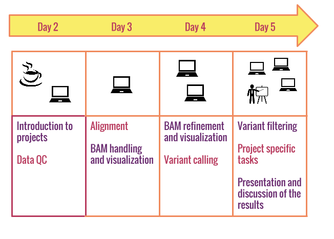
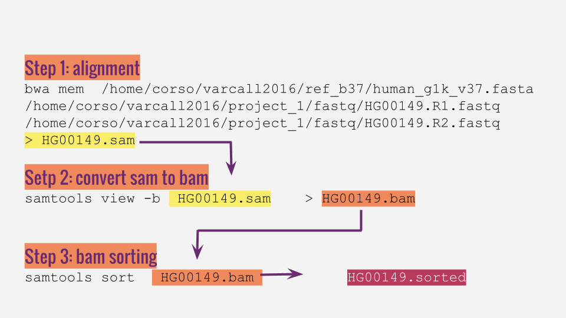
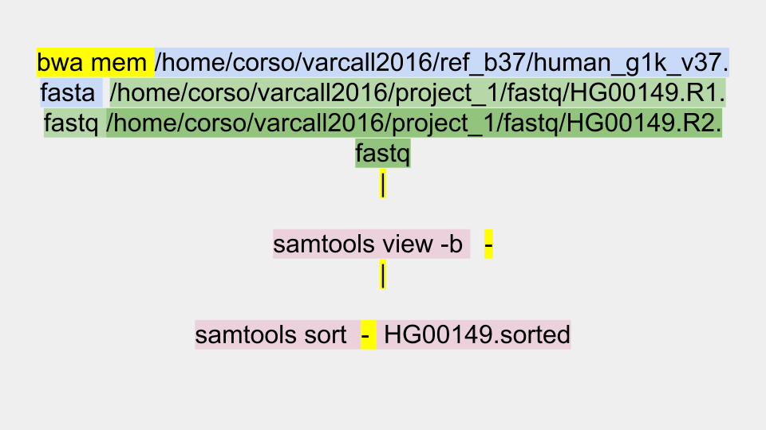
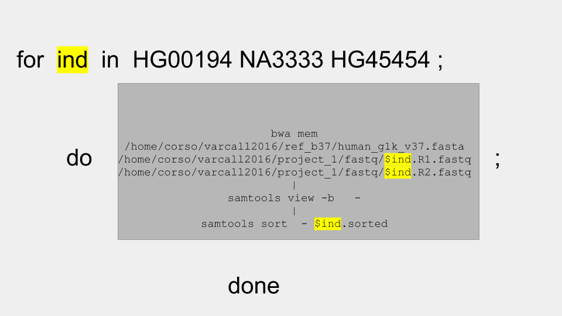

#Summary

- [Projects](#section-id-9)
    - [Familiarize with file formats](#section-id-18)
    - [Ask U.G.O.](#section-id-25)
  - [How to](#section-id-278)
- [Where is the data?](#section-id-888)

<div id='section-id-9'/>

# Projects

This is how the projects are going to work:


Projects will start from `.fastq` files and will end with a beautiful image ready to be published!

You will work in group, however tasks of the two days will be performed individually, while tasks of the last day will be performed as group. In practice each person in the group will process part of the `fastq` files and eventually all the efforts will be merged in the last day from variant calling onward.

<div id='section-id-18'/>

### Familiarize with file formats

When working on projects, you will soon find out that most of the time will be spent to understand the file formats. Don't rush, take time to understand in/output file structure. Read the examples; in general software comes with example files, try to run the example first.  


<div id='section-id-25'/>

### Ask U.G.O.

While doing the projects, if you have problems ask first yourself, than people in the group, than others!


<div id='section-id-30'/>


<div id='section-id-278'/>

## How to

<div id='section-id-280'/>

### Be very well organized:  

- make a project folder: you can work on many project at the same time!
- make project sub-folders: make a folder where to store the data and call it with a reasonable name (e.g. `projectname_data`) ; make sure you will be able to identify folders the day after.
- make a README file where you note main changes and list folder and file content
- give files reasonable names :)

<div id='section-id-888'/>
## Where is the data?

Data are on Bender in the folder `/home/corso/varcall2016` :

```
[corso@benode04 varcall2016]$ pwd
/home/corso/varcall2016

[corso@benode04 varcall2016]$ ll
drwxrwxr-x 3 corso corso  4096  2 mag 14:30 day1
drwxrwxr-x 2 corso corso  4096 22 apr 15:48 day2
drwxrwxr-x 4 corso corso  4096 25 apr 10:40 day3
drwxrwxr-x 2 corso corso  4096 25 apr 12:44 day4
drwxr-xr-x 3 corso corso 20480  2 mag 13:55 project_1
drwxr-xr-x 4 corso corso  4096 28 apr 14:54 project_2
drwxrwxr-x 2 corso corso  4096 29 apr 12:10 ref_b37  

```

Data are organized by days and Projects have their own directories. Within each project folder there is a sub-folder with the fastq files.  

The folder `ref_b37 ` contains the [human reference sequence](https://en.wikipedia.org/wiki/Reference_genome):

```
[corso@benode04 varcall2016]$ ls -lh  ref_b37/
totale 8,0G
-rw-rw-r-- 1 corso corso  11K 29 apr 09:53 human_g1k_v37.dict
-rw-rw-r-- 1 corso corso 3,0G 29 apr 10:24 human_g1k_v37.fasta
-rw-rw-r-- 1 corso corso 6,5K 29 apr 11:51 human_g1k_v37.fasta.amb
-rw-rw-r-- 1 corso corso 6,7K 29 apr 11:51 human_g1k_v37.fasta.ann
-rw-rw-r-- 1 corso corso 2,9G 29 apr 11:50 human_g1k_v37.fasta.bwt
-rw-rw-r-- 1 corso corso 2,7K 29 apr 10:31 human_g1k_v37.fasta.fai
-rw-rw-r-- 1 corso corso 740M 29 apr 11:51 human_g1k_v37.fasta.pac
-rw-rw-r-- 1 corso corso 1,5G 29 apr 12:10 human_g1k_v37.fasta.sa

```

## Loops and Pipes

Trough the tutorials we have learned to do operations step by step and sample by sample. We will now learn how to combine all operations in a single step. We will show as an example a [loop in bash](http://tldp.org/HOWTO/Bash-Prog-Intro-HOWTO-7.html), however loops can be done in any programming language.  


### bwa alignment, sam to bam and bam sorting

As an example let's consider three operations that we would do step by step: every step produces an output that become the input of the next step:  




We can combine all the three steps and write a single command for every single individual (in this case HG00149):

```
bwa mem  /home/corso/varcall2016/ref_b37/human_g1k_v37.fasta  /home/corso/varcall2016/project_1/fastq/HG00149.R1.fastq /home/corso/varcall2016/project_1/fastq/HG00149.R2.fastq | samtools view -b - | samtools sort -  NA21102.sorted

```
as you can see we combined several processes using the pipe [` | `](https://en.wikipedia.org/wiki/Pipeline_%28Unix%29). Because we use pipe the [standard out](https://en.wikipedia.org/wiki/Standard_streams)  of one process become the [standard in](https://en.wikipedia.org/wiki/Standard_streams) of the successive process. Therefore  the standard in become the input file and we indicate this in the command line using the symbol ` - `.




#### Note
#### 1) we use absolute paths
#### 2) because we use absolute paths we don't copy fastq in our folders but we refer to them where they are on the machine


The next step is to make a loop over individuals (in this case HG00194 NA3333 HG45454 ):  




```
for i in HG00194 NA3333 HG45454; do  bwa mem /home/corso/varcall2016/ref_b37/human_g1k_v37.fasta  /home/corso/varcall2016/project_1/fastq/$i.R1.fastq /home/corso/varcall2016/project_1/fastq/$i.R2.fastq | samtools view -b - | samtools sort - $i.sorted  ; done
```

**The loop will not produce output for every single step but only a single output at the end of the process and at all intermediate steps the output file is stored in the computer memory**


If the list of individuals is long we might want to substitute the list with a command that open a file where every line is an individual:

```
for i in $(cat individuals.txt); do  bwa mem /home/corso/varcall2016/ref_b37/human_g1k_v37.fasta  /home/corso/varcall2016/project_1/fastq/$i.R1.fastq /home/corso/varcall2016/project_1/fastq/$i.R2.fastq | samtools view -b - | samtools sort - $i.sorted  ; done
```

For project 1 you will find the list of individuals in the project folder under the name ` individuals.txt `


## `bgzip` and `tabix`
(adapted from [here](https://github.com/ekg/alignment-and-variant-calling-tutorial#aligning-our-data-against-the-e-coli-k12-reference))

We can speed up random access to VCF files by compressing them with `bgzip`, in the [htslib](https://github.com/samtools/htslib) package. `bgzip` is a "block-based GZIP", which compresses files in chunks of lines. This chunking let's us quickly seek to a particular part of the file, and support indexes to do so. The default one to use is `tabix`. It generates indexes of the file with the default name `.tbi`.

```
bgzip SRR1770413.vcf # makes SRR1770413.vcf.gz
tabix -p vcf SRR1770413.vcf.gz
```

Now you can pick up a single part of the file. For instance, we could count the variants in a particular region:

```
tabix SRR1770413.vcf.gz NC_000913.3:1000000-1500000 | wc -l
```

If we want to pipe the output into a tool that reads VCF, we'll need to add the -h flag, to output the header as well.

```
tabix -h SRR1770413.vcf.gz NC_000913.3:1000000-1500000 | vcffilter ...
```

The bgzip format is very similar to that used in BAM, and the indexing scheme is also similar (blocks of compressed data which we build a chromosome position index on top of).
