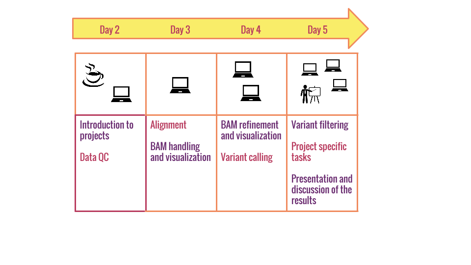

#Summary

- [Projects](#section-id-9)
    - [Familiarize with file formats](#section-id-18)
    - [Ask U.G.O.](#section-id-25)

  - [How to](#section-id-278)

# Projects

This is how the projects are going to work:

Projects will start from `.fastq` files and will end with a beautiful image ready to be published!

You will work in group, however tasks of the two days will be performed individually, while tasks of the last day will be performed as group. In practice each person in the group will process part of the `fastq` files and eventually all the efforts will be merged in the last day from variant calling onward.

### Familiarize with file formats

When working on projects, you will soon find out that most of the time will be spent to understand the file formats. Don't rush, take time to understand in/output file structure. Read the examples; in general software comes with example files, try to run the example first.  

### Ask U.G.O.

While doing the projects, if you have problems ask first yourself, than people in the group, than others!

## How to

### Be very well organized:  

- make a project folder: you can work on many project at the same time!
- make project sub-folders: make a folder where to store the data and call it with a reasonable name (e.g. `projectname_data`) ; make sure you will be able to identify folders the day after.
- make a README file where you note main changes and list folder and file content
- give files reasonable names :)

