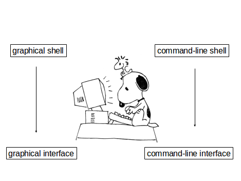
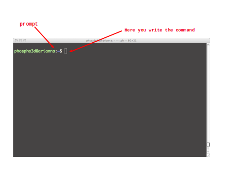
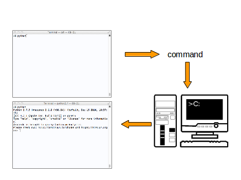

# UNIX command line

## What is the computer shell?

The shell is an interpreter (a program) that lets you interact with the operating system



## What is the graphical interface?


## What is the command line interface (or Terminal)?



## Open a command-line terminal on your computer

You can type a command and then type [Return]:
```
~$ date
sab 23 apr 2016, 08.56.51, CEST
```

Or you can launch a program typing its name at the terminal prompt and then type [Return]:

```
~$ python
Python 2.7.9 (default, Apr  2 2015, 15:33:21)
[GCC 4.9.2] on linux2
Type "help", "copyright", "credits" or "license" for more information.
>>>


```  



## The Terminal can be customized

- Change default color
- Change text size and font
- Increase/decrease transparency
- Resize it
- Have multiple windows open side by side
- Change the command prompt (most commonly a ```$```  or ```%``` sign)
- Make the cursor blinking

## The Unix shell

- The shell is a command-line interpreter that lets you interact with Unix
- The shell takes what you type and decides what to do with it
- The shell is actually a scripting language somewhat like Python
 -It is always possible to change shell (either temporarily or permanently)

## The command-line interface (terminal) allows you:

- to send typed instructions to  the computer (i.e., run programs, move/view files, etc.)
- to see the output that results from  those instructions

>Every time you type any Unix command and **press enter**, the computer will attempt to follow your instructions and then, when finished, return you to the **command prompt**

## What is the filesystem tree?

Type the Unix command ```ls``` at the command prompt: what happens?

```
~$ ls

```

The file-system is arranged in a hierarchical structure, like an inverted tree:

[filesystem] (filesys.png )


The top of the hierarchy is traditionally called **root**
> When you first login, the current working directory is your home directory (containing files and directories that only you can modify)

## How can you navigate the filesystem?

Most likely you will need to navigate the filesystem to:

- Find out where you are in the filesystem
- Change directory
- Find your way home
- Make a new directory
- Remove a file
- Remove a directory

## What is the path of a file or a directory?

The path indicate the place in the filesystem where a file is. Slashes separate parts of the directory path:

```
/home/allegra/courses/TGAC2015/Academis_Linux.pdf

```

## Did you know that... everything in Unix is either a file or a process?

- A **process** is an executing program identified by a unique PID
(PID = Process IDentifier)

- A **file** is a collection of data


### What is a computer program? Which ones do you know?

### Where can we write programs?

### What is a text editor? Which ones do you know?

Access your home directory using the command-line interface:

```
[corso@benode01]$ students/myname

```
Start the nano text editor:

```
[corso@benode01]$ nano

```
[addd image](nano.png )

- Create a text file “myfile.txt” and save it in your home directory
- Go to the command-line interface and type ``` ls ``` at the prompt: can you see the newly created file?

```
[corso@benode01 ~]$ ls -l
-rw-rw-r--  1 corso corso    0 28 apr 14:50 myfile.txt

```

## About Unix commands

**Commands are themselves programs**:

```
[corso@benode01]$ rm myfile.txt
[corso@benode01]$

```

• The shell searches the file containing the program rm
• executes the program rm on myfile.txt
• After the process rm myfile.txt has finished running,
  the shell returns the prompt ``` $ ```, indicating that it is waiting for  
  further commands.

List the files in the directory. Can you see the ``` myfile.txt ```?

```
  [corso@benode01]$ ls -l

```
------

## Challenge

### Replace the XXX

• If you've made a typo: XXX to cancel the whole line
• Unix is XXX-sensitive
• XXX sets the cursor at the beginning of the line
• XXX sets the cursor at the end of the line
• You can use up and down XXX to recall commands
• The command XXX tells you where is a given program
• You can use a XXX to write programs

### Options and arguments
• There are commands that can take XXX
• Commands may also take XXX
• XXX change the behaviour of the command
• XXX are the objects on which commands act
• You will specify XXX using a XXX
• The command name, XXX and XXX must be separated by XXX

### A few more questions…
• What is command-line completion?
• What is a default argument?

## How can we run programs on Unix?

Prerequisites to run a program are:

1. The program must be executable
2. You have to tell the shell which "interpreter" will read and execute the program AND where it will find it
3. You must be in the same directory as the program you want to run OR….
4. ….you can prefix its name with a path OR…
5. …the path to your program must in the PATH environment variable
6. The program must be somewhere on your computer

## Is my script executable? File system security (access rights)

Each file (and directory) has associated access rights, which may
be found by typing ```ls -l```

[figslide34 ](figslide34)

Access rights on directories:
- **r** allows users to list files in the directory
- **w** allows users to delete files from the directory or move files into it
- **x** allow users to access files in the directory

## How can I make my script executable?

The command to change access rights is [chmod](https://en.wikipedia.org/wiki/Chmod)

```
$ chmod go-rwx myfile.txt
$ chmod a+x my_script

```
| **Symbol**  |**Meaning** |
|----|-----|
| u|user     |
| g|group |
| o|other     |
| a|all|
| r|read     |
| w|write (and delete) |
| x| execute (and access direcotry)|
| +| add permission|
| -| take away permission |

## My first shell script

Write commands in a file and make the file executable:

[first](../img/first.png)
